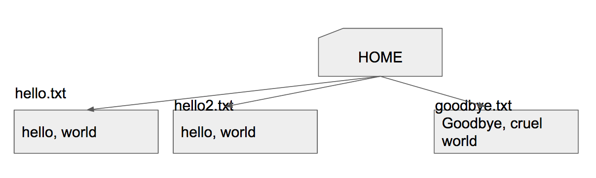
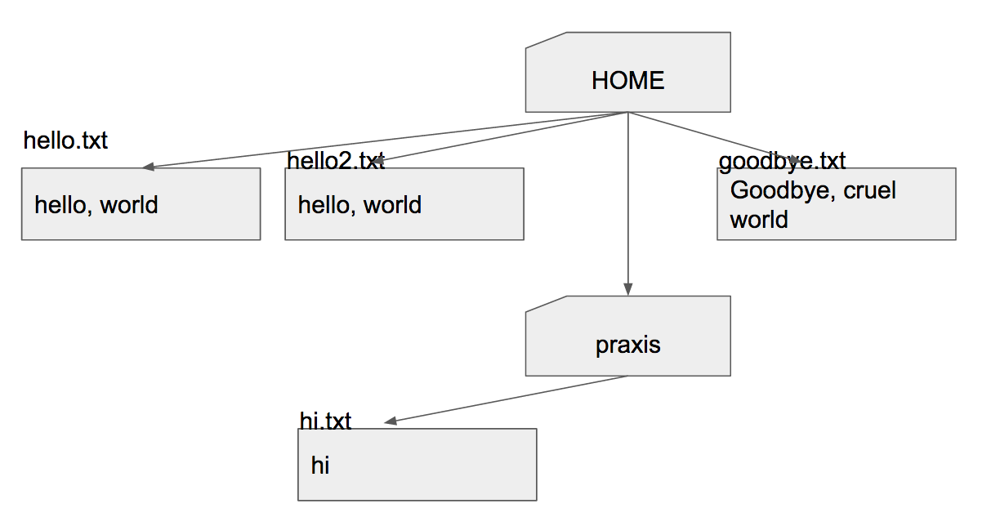
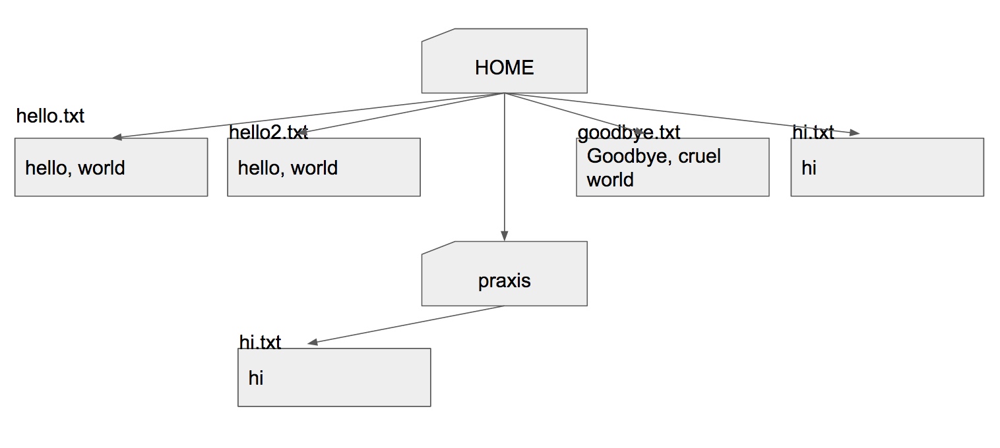
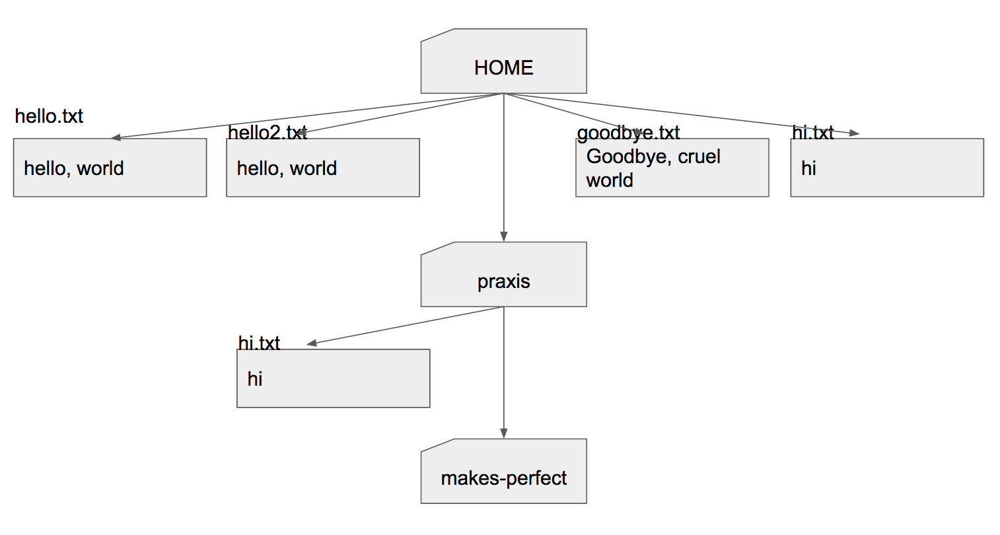

# Directories

We've seen files. Now come folders, which are called *directories*.

* `mkdir praxis`
* Create a file in that directory
* `echo hi > praxis/hi.txt`

* `praxis/hi.txt` is called a **relative path**.
* `cat praxis/hi.txt`
* It is relative to the **working directory** (also called the **current directory**)
* `pwd`
* This is how we know the working directory (pwd = "Print Working Directory")
* `ls praxis`
* `cd praxis`
* We Changed the workding Directory to praxis
* `cat hi.txt`
* Note that we don't need 'praxis/' anymore
* `cat ../hello.txt`
* `..` is the **parent directory**
* `ls .`
* `.` is the current direcoty
* `ls ..`
* `cat ./hi.txt`
* What does this do?
* `cat hi.txt > ../hi.txt`

* How do we go back to previous dir?
* `cd ..`
* `mkdir praxis/makes-perfect`

* `cd praxis/makes-perfect`
* `ls ..`
* `ls ~`
* `~` expands in the shell to the home directory

# Summary of commands

* pwd
* cd _dir_
* .. is the parent directory
* . is the current directory
* ~ expands to the home directory
* _dir_/_dir_/... is a relative path to a file or directory
