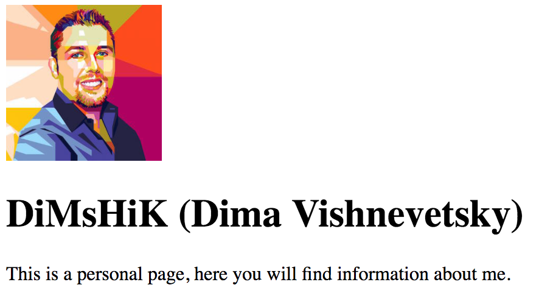
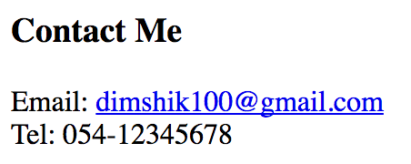
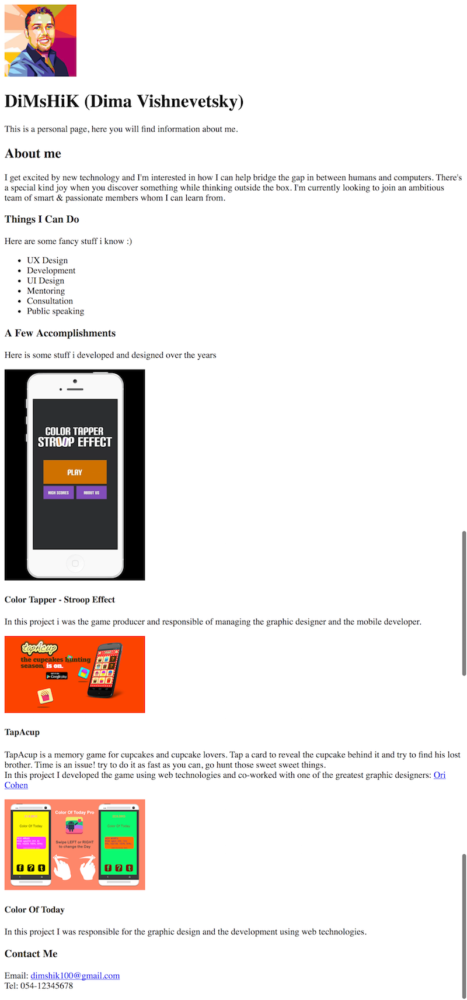

# My Info Exercise

## Step 0 - Document title

* Change the title of the document to "<Your name> personal page".

## Step 1 - Personal

* Add you personal image.
* Width and height should be 128 pixels.
* An "alt" attribute should be added to the image with the
  description of the content. It's your image, so your name
  will be enough.
* Add your name (and nickname if you have one).
* This should be tha main title on the page.
* Add a short paragraph that describes what is this page.

## Step 2 - About me

* Add is a second level title "About me".
* Write a paragraph, or multiple paragraphs about that describe who you are and what are your objectives.

## Step 3 - Things you can do

* Add is a third level title "Things I Can Do".
* Write a short sentence that describes the list (optional).
* Create a list of "Things" you feel important to people to know about you.

## Step 4 - Accomplishments

* Add is a third level title "A Few Accomplishments".
* Write a short sentence that describes the list (optional).
* Each accomplishment will be structured as follows:
  * An image of the accomplishment / project / Thing.
  * Width of the image should be 250px.
  * Add "alt" attribute to the image that describes it.
  * If the Accomplishment is somewhere online, a live link to it should wrap the image.
  * The Project name should be a forth level title.
  * Write a paragraph, or multiple paragraphs to describe the project.

## Step 5 - Contact

* Add is a third level title "Contact me".
* Add your email. It should be linked to your real email.
* Add your phone number. It should be linked to your real number.

## Full example

Don't forget to breath, commit, and push.

