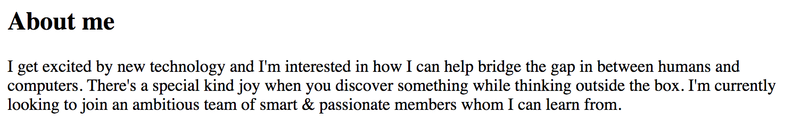
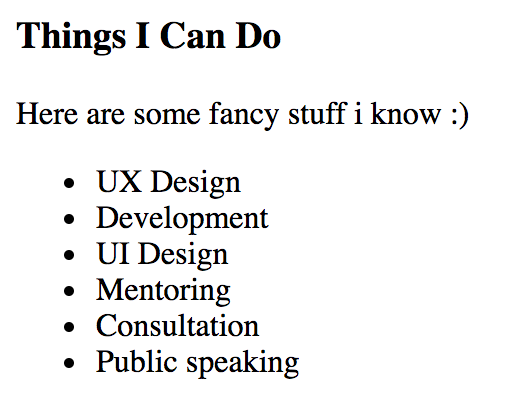
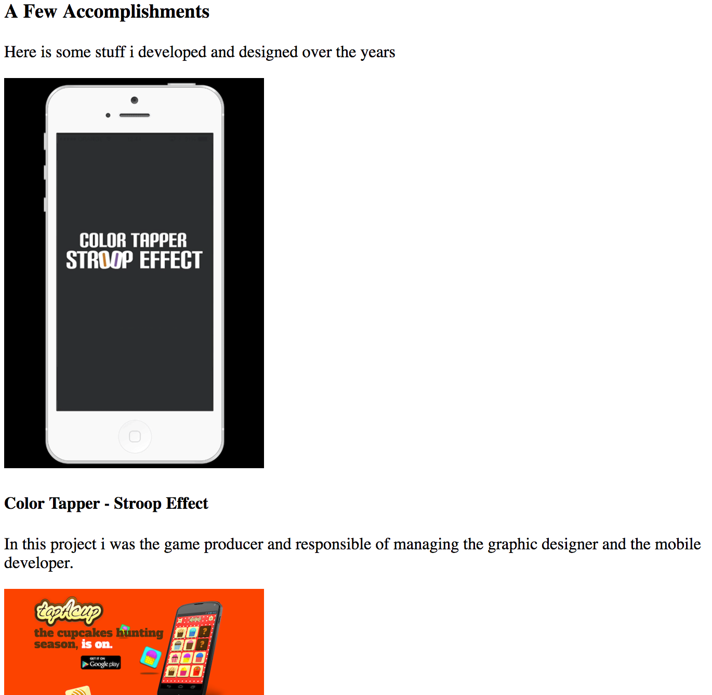

# My Info Exercise

* All work should be done in a new repository (`personal-page`), so create one please:
* Goto your Github account, press the "+" sign on the top right,
  and choose "New repository"
* The name should be `personal-page`.
  In the description give a nice description of the project.
* Add a "gitignore". Choose "Node" for the gitignore.
* That's it - submit - you have a new repo!
* Now you need to clone it. What? You don't remember?!
  That's OK, you can follow the explanation from [our Git lesson]
  (../../04-Git-and-markdown/4-push-pull.md). And don't forget to do it from
  the `projects` directory you created in the Git praxis.
* And after forking, don't forget to `cd personal page` and open it in Visual Studio Code,
  using `code .`.

## Step 0 - Document title

* Create a new `index.html` file. This will be your
  personal page HTML file.
* Make the title of the document to "<Your name> personal page".
* Try it out in your browser. is the title of the document changed?
* Perfect! Our goal is to create a page that looks like the one below, but filled with
  your information. You can do it by yourself, or you can follow the steps below:
* The page:

---

---

## Step 1 - Personal

* Add a personal image.
* Width and height should be 128 pixels.
* Make sure that the image does not look stretched. If it is, fix it.
  (How? We didn't learn that! So? Get help from the internet, or from a co-student.
   or from the teacher.)
* An "alt" attribute should be added to the image with the
  description of the content. It's your image, so your name
  will be enough.
* Add your name (and nickname if you have one).
* This should be tha main title on the page.
* Add a short paragraph that describes what is this page.
* The end result should look something like this:

---

---

## Step 2 - About me

* Add is a second level title "About me".
* Write a paragraph, or multiple paragraphs about that describe who you are and what are your objectives.

---

---

## Step 3 - Things you can do

* Add is a third level title "Things I Can Do".
* Write a short sentence that describes the list (optional).
* Create a list of "Things" you feel important to people to know about you.

---

---

## Step 4 - Accomplishments

* Add is a third level title "A Few Accomplishments".
* Write a short sentence that describes the list (optional).
* Each accomplishment will be structured as follows:
  * An image of the accomplishment / project / Thing.
  * Width of the image should be 250px.
  * Add "alt" attribute to the image that describes it.
  * If the Accomplishment is somewhere online, a live link to it should wrap the image.
  * The Project name should be a forth level title.
  * Write a paragraph, or multiple paragraphs to describe the project.

---

---

## Step 5 - Contact

* Add is a third level title "Contact me".
* Add your email. It should be linked to your real email.
* Add your phone number. It should be linked to your real number.

---

---
