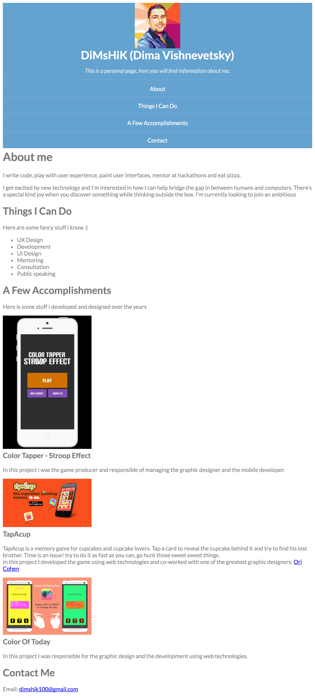

# Style your personal info page

Your page looks... ugly right now. It's time to style it, so that it will look
something like this:

---

---

## CSS File

* The CSS rules should not reside in the HTML file, but should be in a file.

## Measuring Colors and Distances

* To figure out the distances and the colors in the page, you can look in the
  Chrome Extensions Store. I recommend the following extensions:
  * ColorZilla for picking colors from the screen
  * Dimensions for showing the length of things on the screen

## Font

* The font is difficult to determine, so here it is:
* The body font family is Lato, which is a sans-serif.
  * Get it from here * [Lato](https://fonts.googleapis.com/css?family=Lato:400,400italic,700,700italic)

## Text Styling

* Format the body according to the sample page above
* Note that underlines react differently under hover.

## Header styling

* Format the headers, except for the header inside the blue heading.

## Header inside heading style

* Style the image, header, and header paragraph according to the sample page above

## Menu

* Style the menus according to the sample page above

