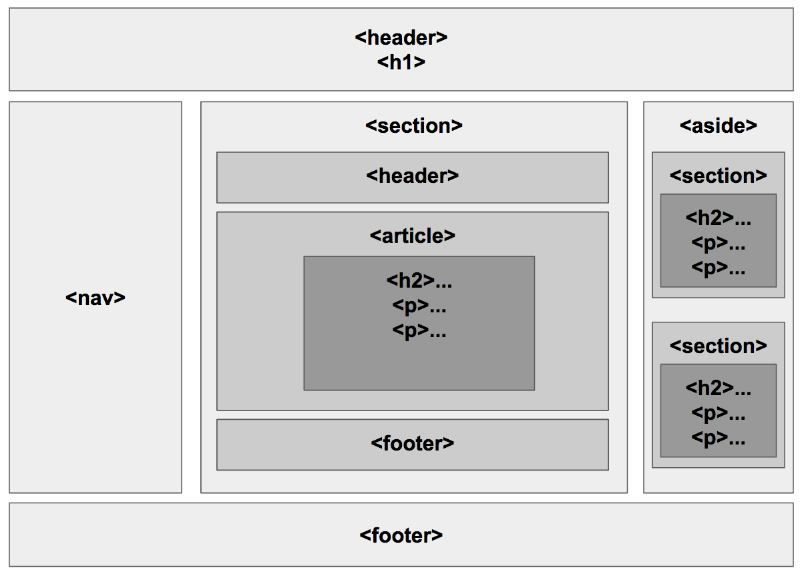

# HTML5 Semantics

## Grouping Elements

### `<main>`

Represents the main content of the body of a document or application

* Can have only one `<main>` in a document
* Should not be placed within an `<article>`, `<aside>`, `<header>`, `<footer>` or `<nav>` elements

### `<header>`

Represents the introductory content to an article or a web page

#### Usage

* A heading of a blog post, including some meta data
* A table of contents, before a long article, within a `nav` tag
* The head section of a web page (Logo, Navigation, Search Box, etc.)

### `<footer>`

Represents information about a section

#### Usage

* Author details
* Copyright information
* Links to related web pages

## Sectioning Elements

### `<nav>`

Used to mark up a collection of links to external pages or sections within the current page

#### Usage

* Main website navigation
* Table of Contents
* Blogroll

### `<article>`

Represents a self-contained content that could be distributed outside the context of the page

* Can have nested articles, like a blog post and each comment on it’s own

#### Usage

* Forum post
* Newspaper article
* Blog entry
* User-submitted comment
* Interactive widget or gadget
* Any other independent item of content

### `<section>`

Represents a group of related content

* Similar to `<article>`, but doesn't necessarily need to make sense out of the context of the page
* Should have a heading in it, to define the topic of the section
* Should not be used just for styling
* Can have nested sections

#### Usage

* Chapters of an article or post
* Tabbed pages

### `<aside>`

Represents content that is tangibly related to the content surrounding it, but could be considered separate

#### Usage

* Sidebars
* Extra info in an article or post
* Anything that is related but not so important

## Next

* The next pages will show an article page, with all the above elements used in it.
