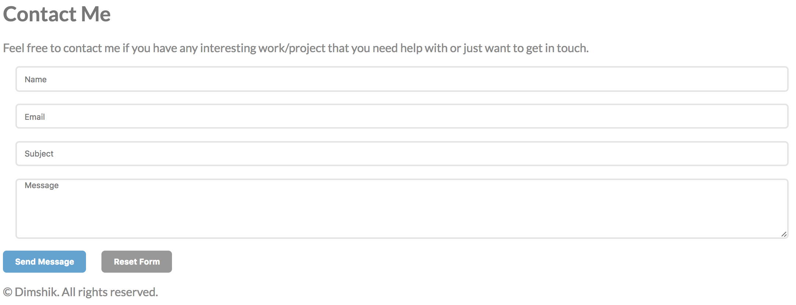
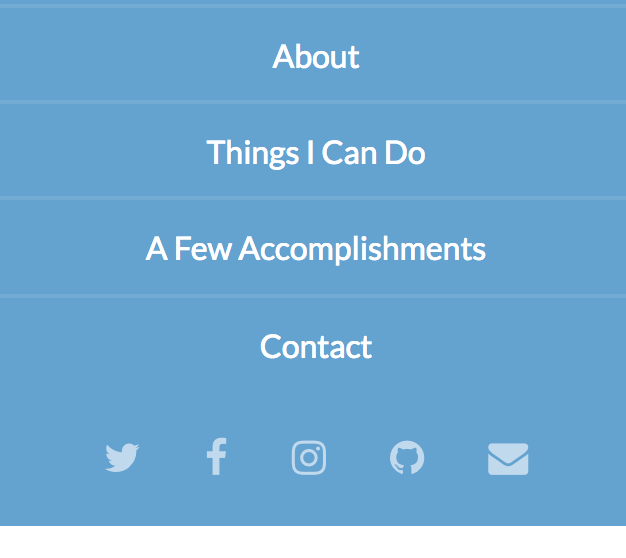
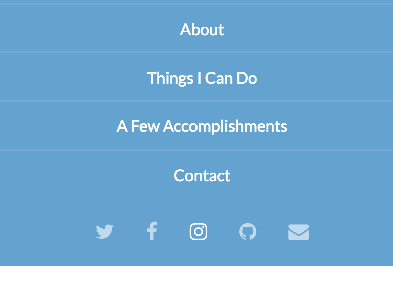

# Semantic Tagging and Others

* We will now turn our HTML into fully semantic HTML

## Adding semantic tags and structure

* Go for it - turn the generic HTML into Semantic HTML
* Refactor CSS to address the correct tags and ids.

## Adding a Contact Form

* (This has nothing to do with semantic tagging.
  It's just a continuation of the project.)
* Add a contact form at the end, just before the copyright notice.
* It should look like this:

---

---

## Adding Link Logos

* Use "Font awesome" to add the following logos (with links!) to your various accounts
  on the Internet.
* If you don't (yet!) have an account in one of those social networks,
  just link to the homepage.
* It should look like this:

---

---

* How? Look [here](http://fontawesome.io/), and learn it by yourself.
* They should have a hover effect on them:

---

---

## Adding Nice Bullets

* Using Font Awesome, replace the bullets in your "Things I can do"
  with skill bullets, like in this screenshot:

---

---
